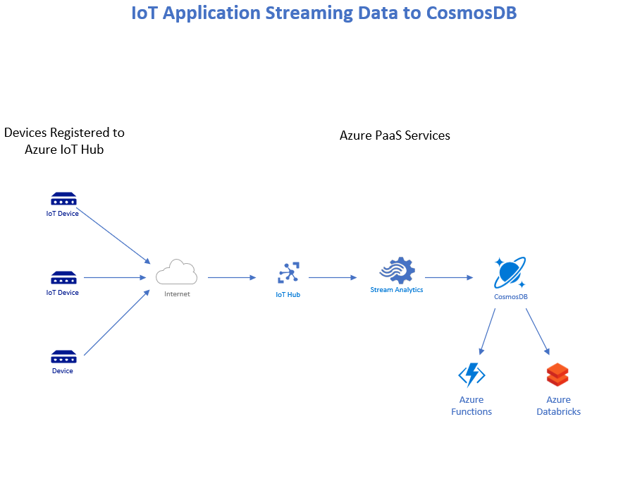
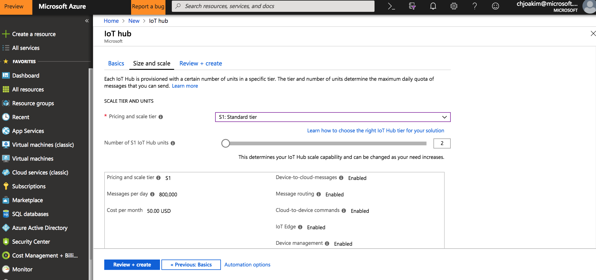
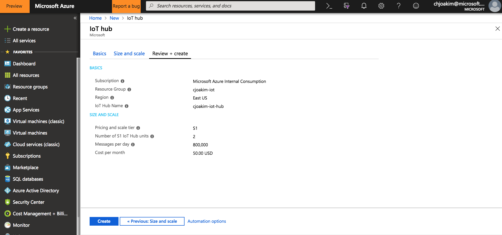
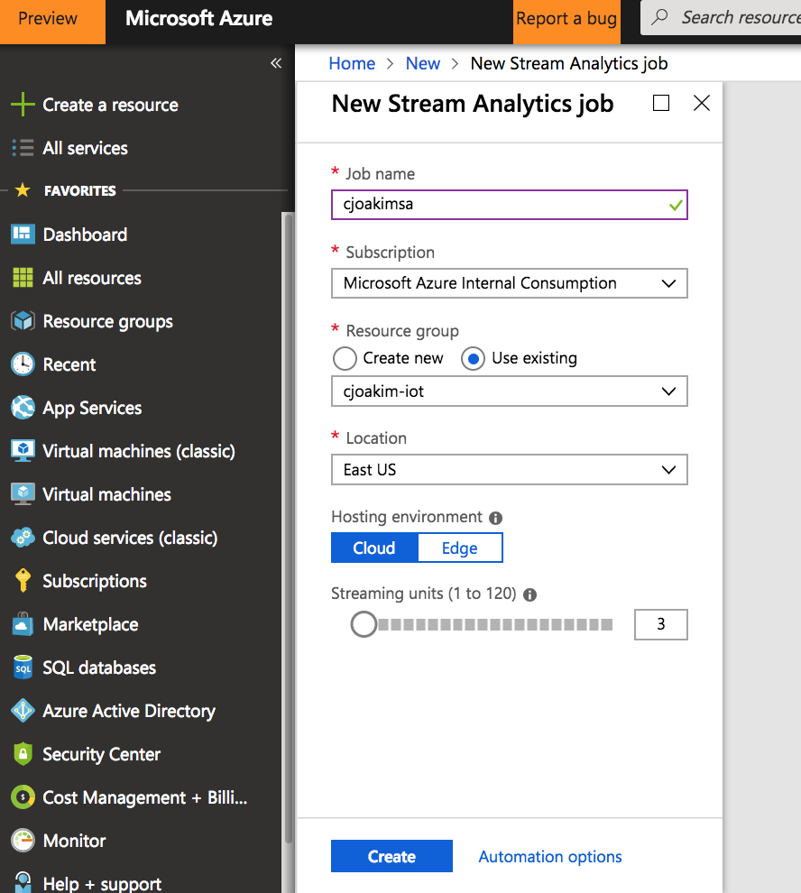
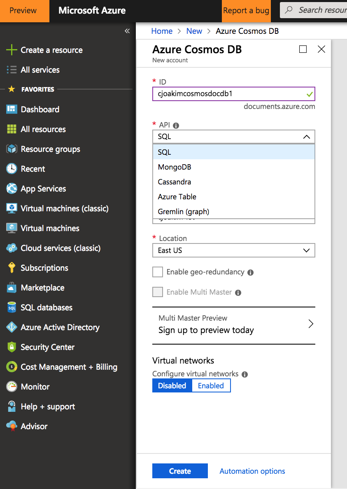
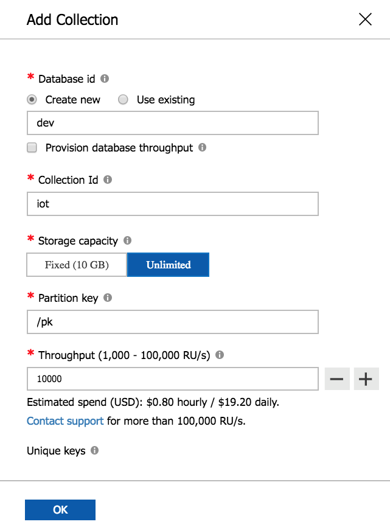
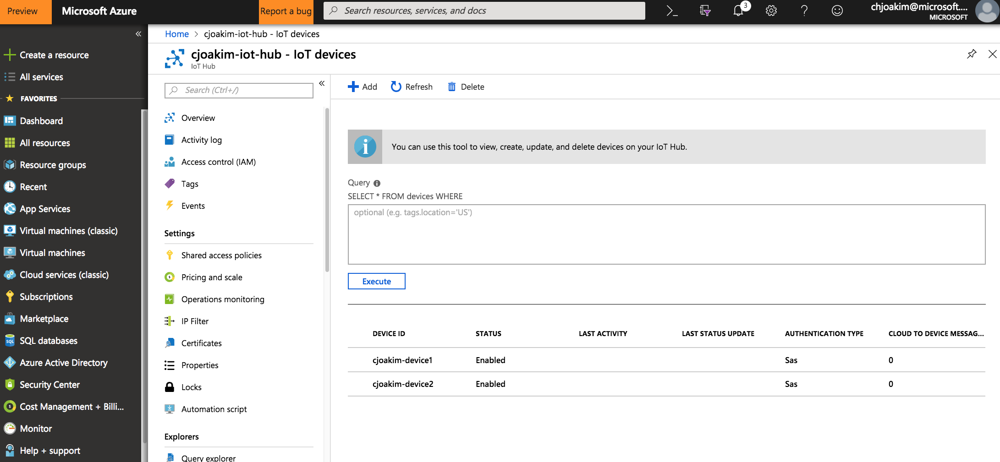

# azure-cosmosdb-iot

An implementation of an IoT streaming data pipeline using the following Azure PaaS services:
- Azure IoT Hub
- Azure Stream Analytics
- Azure CosmosDB with SQL API
- Simulated IoT devices implemented in Node.js.



---

## Links

- https://docs.microsoft.com/en-us/azure/iot-hub/quickstart-send-telemetry-node

---

## Provision Azure Resources

### Provision an IoT Hub PaaS Service

Name: cjoakim-iot-hub
Hostname: cjoakim-iot-hub.azure-devices.net
Pricing and scale tier: S1 - Standard





### Provision a Stream Analytics PaaS Service



### Provision a CosmosDB PaaS Service

Create an Azure CosmosDB with the SQL API (i.e. - DocumentDB).



Then create the **iot** collection in the **dev** database.  
Specify **unlimited storage capacity**, a **partition key** named **/pk**,
and a **throughput of 10,000 RUs**.



---

## Register Simulated Devices with the Azure CLI

Verify that you have a recent version of the **az CLI program**:
```
$ az --version
azure-cli (2.0.44)
...
```

Add the az extension for IoT, add two simulated devices, and get their connection-strings:
```
$ az extension add --name azure-cli-iot-ext

$ az iot hub device-identity create --hub-name cjoakim-iot-hub --device-id cjoakim-device1
$ az iot hub device-identity show-connection-string --hub-name cjoakim-iot-hub --device-id cjoakim-device1 --output json

$ az iot hub device-identity create --hub-name cjoakim-iot-hub --device-id cjoakim-device2
$ az iot hub device-identity show-connection-string --hub-name cjoakim-iot-hub --device-id cjoakim-device2 --output json
```

Visit Azure Portal, and see that the new devices are listed:



---

## Implement the Stream Analytics Job

---

## Send Events to the IoT Hub

First, install the Node.js NPM libraries:
```
$ npm install
```

Next, send 1000 messages, pausing 250 milliseconds between messages.
```
node simulated_device.js device1 250 1000 send
```

The devices send JSON data that looks like the following.
Note the [GeoJSON](http://geojson.org) with the current GPS coordinates of the device.
```
{
  "pk": "device1",
  "device": "device1",
  "seq": 5,
  "date": "2018-08-28T21:28:33.979Z",
  "epoch": 1535491713979,
  "temperature": 30.027234564934837,
  "humidity": 77.79822510371012,
  "location": {
    "type": "Point",
    "coordinates": [
      "-122.67533926293254",
      "45.51593195647001"
    ]
  },
  "dist_meters": "89.48999786376953",
  "alt_meters": "13.800000190734863"
}
```
